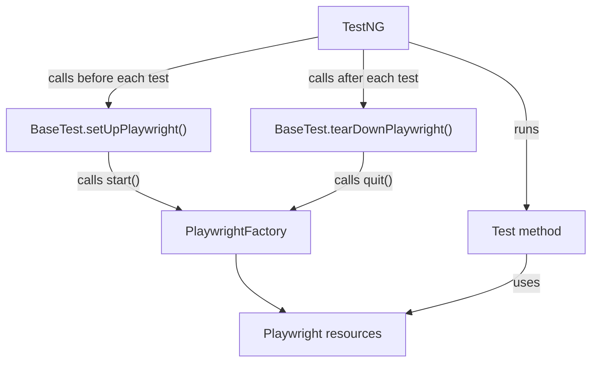

# BaseTest Documentation

## Beginner-Friendly Guide for Playwright Java, TestNG, Maven, and Page Object Model

This document explains the `base.BaseTest` class used with `factory.PlaywrightFactory`.

It is written for:

- A tester new to automation
- A tester with about one year of Java or Selenium experience
- Someone learning TestNG lifecycle annotations
- A nontechnical team member who wants to understand how tests start and stop a browser
- A framework maintainer who needs to understand failure handling and parallel execution

Although `BaseTest.java` is a small class, it performs an important job: it connects TestNG's test lifecycle to the Playwright resource lifecycle.

> **IntelliJ IDEA note:** This is a documentation file, not one Java source file. Complete source-file examples are tagged `java`; explanatory fragments, expressions, and intentionally incomplete examples are tagged `text`. This prevents IntelliJ from treating documentation fragments as compilable Java. To hide those false positives, open `Settings` (`Ctrl+Alt+S`) → `Languages & Frameworks` → `Markdown` and clear **Show problems in code fences**. Keep **Inject languages in code fences** enabled if you still want Java syntax highlighting; clear both options only if you want no code assistance in fenced blocks. See the [JetBrains Markdown documentation](https://www.jetbrains.com/help/idea/markdown.html).

---

## 1. BaseTest in simple language

Think about a hotel room prepared for a guest:

1. Before the guest arrives, the hotel prepares a clean room.
2. The guest uses the room.
3. After the guest leaves, the hotel cleans and closes the room.

`BaseTest` does the same thing for every automated test:

1. Before the test, it asks `PlaywrightFactory` to create Playwright, a browser, a clean browser context, and a page.
2. The test uses the page.
3. After the test, it asks the factory to close everything.

```text
Before test   → Create browser resources
Test          → Use Page Objects and Page
After test    → Close browser resources
```

The test developer does not need to repeat browser setup and cleanup code inside every test.

---

## 2. Where BaseTest belongs

Recommended test-source structure:

```text
src/test/java
├── base
│   └── BaseTest.java
├── factory
│   └── PlaywrightFactory.java
├── pages
│   ├── LoginPage.java
│   └── HomePage.java
└── tests
    ├── LoginTest.java
    └── HomePageTest.java
```

The package declaration must match the directory:

```text
package base;
```

Therefore, the normal file location is:

```text
src/test/java/base/BaseTest.java
```

---

## 3. Complete BaseTest class

```java
package base;

import com.microsoft.playwright.Browser;
import com.microsoft.playwright.BrowserContext;
import com.microsoft.playwright.Page;
import com.microsoft.playwright.Playwright;
import factory.PlaywrightFactory;
import org.testng.ITestResult;
import org.testng.annotations.AfterMethod;
import org.testng.annotations.BeforeMethod;

/** TestNG lifecycle for the thread-local PlaywrightFactory. */
public abstract class BaseTest {

    @BeforeMethod(alwaysRun = true)
    public final void setUpPlaywright() {
        PlaywrightFactory.start();
    }

    @AfterMethod(alwaysRun = true)
    public final void tearDownPlaywright(ITestResult testResult) {
        try {
            PlaywrightFactory.quit();
        } catch (RuntimeException | Error cleanupFailure) {
            Throwable testFailure = testResult.getThrowable();

            if (testFailure != null) {
                // Preserve the real assertion/test failure as the primary cause.
                testFailure.addSuppressed(cleanupFailure);
                return;
            }

            throw cleanupFailure;
        }
    }

    protected final Page page() {
        return PlaywrightFactory.page();
    }

    protected final BrowserContext context() {
        return PlaywrightFactory.context();
    }

    protected final Browser browser() {
        return PlaywrightFactory.browser();
    }

    protected final Playwright playwright() {
        return PlaywrightFactory.playwright();
    }

    protected final BrowserContext newContext() {
        return PlaywrightFactory.newContext();
    }
}
```

---

## 4. Relationship between TestNG, BaseTest, and PlaywrightFactory



The classes have different responsibilities:

| Component           | Responsibility                                               |
|---------------------|--------------------------------------------------------------|
| TestNG              | Finds tests and controls when setup, tests, and teardown run |
| `BaseTest`          | Connects TestNG lifecycle events to the factory              |
| `PlaywrightFactory` | Creates, stores, validates, and closes Playwright resources  |
| Page Object         | Contains page locators and application actions               |
| Test class          | Describes the scenario and performs assertions               |

`BaseTest` does not launch Chromium, Firefox, or WebKit directly. It delegates that work to `PlaywrightFactory`.

---

## 5. Why BaseTest is abstract

The class declaration is:

```text
public abstract class BaseTest {
```

### Meaning of `public`

`public` allows test classes in other packages to extend `BaseTest`.

For example, a class in the `tests` package can use:

```text
public final class LoginTest extends BaseTest {
}
```

### Meaning of `abstract`

`abstract` means `BaseTest` is a parent framework class. It is not intended to be executed as a test by itself.

You do not write:

```text
BaseTest baseTest = new BaseTest();
```

That is not allowed because the class is abstract.

Instead, a real test class inherits its behavior:

```text
public final class LoginTest extends BaseTest {
}
```

This gives `LoginTest` access to:

- Automatic Playwright setup
- Automatic Playwright cleanup
- `page()`
- `context()`
- `browser()`
- `playwright()`
- `newContext()`

### Meaning of `extends`

```text
public final class LoginTest extends BaseTest
```

`extends` means that `LoginTest` inherits the accessible methods and TestNG configuration behavior defined in `BaseTest`.

In simple language:

```text
LoginTest is a test class that receives BaseTest's setup and cleanup behavior.
```

---

## 6. Imports explained

### Playwright imports

```text
import com.microsoft.playwright.Browser;
import com.microsoft.playwright.BrowserContext;
import com.microsoft.playwright.Page;
import com.microsoft.playwright.Playwright;
```

| Type             | Simple meaning                                          |
|------------------|---------------------------------------------------------|
| `Playwright`     | The root Playwright Java entry point                    |
| `Browser`        | A launched Chromium, Firefox, or WebKit browser process |
| `BrowserContext` | An isolated, incognito-like browser session             |
| `Page`           | A browser tab used for navigation and UI interaction    |

### Factory import

```text
import factory.PlaywrightFactory;
```

This allows `BaseTest` to call the project's factory methods.

### TestNG imports

```text
import org.testng.ITestResult;
import org.testng.annotations.AfterMethod;
import org.testng.annotations.BeforeMethod;
```

| Type            | Purpose                                                                      |
|-----------------|------------------------------------------------------------------------------|
| `@BeforeMethod` | Marks code that TestNG runs before every test method invocation              |
| `@AfterMethod`  | Marks code that TestNG runs after every test method invocation               |
| `ITestResult`   | Gives teardown information about whether the test passed, failed, or skipped |

---

## 7. Setup method explained

The setup method is:

```text
@BeforeMethod(alwaysRun = true)
public final void setUpPlaywright() {
    PlaywrightFactory.start();
}
```

### What `@BeforeMethod` means

TestNG calls this method before each `@Test` method invocation.

Example class:

```text
public final class AccountTest extends BaseTest {

    @Test
    public void userCanViewProfile() {
    }

    @Test
    public void userCanUpdateProfile() {
    }
}
```

The lifecycle is:

```text
setUpPlaywright()
userCanViewProfile()
tearDownPlaywright()

setUpPlaywright()
userCanUpdateProfile()
tearDownPlaywright()
```

Each test receives fresh resources.

### What `alwaysRun = true` means

```text
@BeforeMethod(alwaysRun = true)
```

This tells TestNG that the framework setup should run even when group-related configuration might otherwise prevent a configuration method from running.

It does not guarantee that setup can run after a fatal JVM failure, forced process termination, or an agent machine crash. It controls TestNG configuration behavior inside a running test process.

### What `public` means here

TestNG can invoke the method as part of the class lifecycle. Public visibility is straightforward and avoids restrictive-access confusion in a shared framework.

### Why the method is `final`

```text
public final void setUpPlaywright()
```

`final` prevents a child test class from overriding the framework setup.

Without `final`, someone could accidentally write:

```text
@Override
public void setUpPlaywright() {
    // Factory startup accidentally removed.
}
```

Then `page()` would fail because Playwright was never initialized.

The final method protects the framework lifecycle.

### What `void` means

The method performs setup work but does not return an object directly. The factory stores the resources for the current test thread, and accessors such as `page()` retrieve them later.

### What `PlaywrightFactory.start()` creates

The factory creates:

```text
Playwright
└── Browser
    └── Primary BrowserContext
        └── Primary Page
```

The browser type and options come from Maven/JVM `-D` properties.

Example:

```bash
mvn test \
  -Dbrowser=firefox \
  -Dheadless=false \
  -Dplaywright.debug=api
```

`BaseTest` does not need to know the selected browser. It simply calls `start()`.

---

## 8. Test execution explained

After setup succeeds, TestNG executes the test method.

```text
@Test
public void userCanOpenLoginPage() {
    page().navigate("https://example.com/login");
}
```

The `page()` method comes from `BaseTest`.

The real call chain is:

```text
LoginTest.page()
    ↓ inherited from BaseTest
BaseTest.page()
    ↓ delegates to
PlaywrightFactory.page()
    ↓ retrieves from current thread state
Page
```

The test class does not need a field such as:

```text
private Page page;
```

It can call the inherited `page()` method whenever it needs the current page.

---

## 9. Teardown method explained

The teardown method is:

```text
@AfterMethod(alwaysRun = true)
public final void tearDownPlaywright(ITestResult testResult) {
    try {
        PlaywrightFactory.quit();
    } catch (RuntimeException | Error cleanupFailure) {
        Throwable testFailure = testResult.getThrowable();

        if (testFailure != null) {
            testFailure.addSuppressed(cleanupFailure);
            return;
        }

        throw cleanupFailure;
    }
}
```

### What `@AfterMethod` means

TestNG calls this method after every test method invocation.

It runs after:

- A passed test
- A failed assertion
- A test method exception
- Many skipped-test situations in which TestNG executes configuration cleanup

### Why `alwaysRun = true` matters in teardown

Cleanup should not be skipped only because the test failed or belongs to a group with special execution rules.

```text
@AfterMethod(alwaysRun = true)
```

instructs TestNG to make the teardown configuration method eligible to run regardless of the test result.

This reduces the risk of leaving browser processes open after a failed test.

### What `ITestResult` provides

TestNG supplies the current test result automatically:

```text
ITestResult testResult
```

You do not manually create or pass this object.

The method uses:

```text
testResult.getThrowable()
```

Possible result:

```text
null                 → The test did not already have a failure exception
Throwable instance   → The test failed with an assertion or exception
```

### Why cleanup is inside `try/catch`

Most cleanup succeeds:

```text
PlaywrightFactory.quit();
```

However, cleanup might fail because:

- The browser process crashed
- The connection to the Playwright driver ended
- A context close operation failed
- The operating system terminated the browser

The catch block decides whether cleanup failure should become the main failure.

### Scenario 1: test passed, cleanup failed

```text
Test failure:    none
Cleanup failure: yes
```

The code rethrows the cleanup failure:

```text
throw cleanupFailure;
```

The test should not appear successful when framework cleanup failed unexpectedly.

### Scenario 2: test failed, cleanup succeeded

```text
Test failure:    yes
Cleanup failure: none
```

TestNG reports the original test failure normally.

### Scenario 3: test failed and cleanup also failed

```text
Test failure:    yes
Cleanup failure: yes
```

The code keeps the original test failure as the main problem:

```text
testFailure.addSuppressed(cleanupFailure);
```

This produces a logical report:

```text
Primary failure:    The login assertion failed
Suppressed failure: Browser cleanup also failed
```

Without this handling, the cleanup exception might hide the reason the application test actually failed.

### Meaning of suppressed exception

A suppressed exception is an additional failure attached to another exception.

It means:

```text
“This was not the main failure, but it also happened and should not be lost.”
```

### Why the catch uses multi-catch

```text
catch (RuntimeException | Error cleanupFailure)
```

This uses one block when the required handling is the same for both categories.

---

## 10. Accessor methods explained

The remaining methods expose resources belonging to the current test.

### `page()`

```text
protected final Page page() {
    return PlaywrightFactory.page();
}
```

Use this for normal browser-tab actions:

```text
page().navigate("/login");
page().getByLabel("Username").fill("tester");
page().getByRole(
        com.microsoft.playwright.options.AriaRole.BUTTON,
        new Page.GetByRoleOptions().setName("Sign in")
).click();
```

This is the accessor most tests will use.

### `context()`

```text
protected final BrowserContext context() {
    return PlaywrightFactory.context();
}
```

Use it for actions belonging to the current isolated browser session:

```text
context().clearCookies();
```

A `BrowserContext` is comparable to a new incognito-like session. It isolates cookies, local storage, session storage, and login state.

### `browser()`

```text
protected final Browser browser() {
    return PlaywrightFactory.browser();
}
```

This returns the browser owned by the current test.

Normal tests usually do not need to direct browser access. It is exposed for advanced framework scenarios.

### `playwright()`

```text
protected final Playwright playwright() {
    return PlaywrightFactory.playwright();
}
```

This returns the current test's Playwright root object.

Page Objects should not normally require this object. They should receive a `Page`.

### `newContext()`

```text
protected final BrowserContext newContext() {
    return PlaywrightFactory.newContext();
}
```

This creates another isolated browser session for the same test.

Typical uses:

- Administrator and customer
- Buyer and seller
- Sender and receiver
- Approver and requester
- Two users collaborating in the same scenario

### Meaning of `protected`

The accessor methods are `protected`:

```text
protected final Page page()
```

This means child test classes can call them, but they are not general public framework methods for unrelated application code.

### Meaning of `final` on accessors

The accessors are final so a child class cannot change what `page()` means.

For example, this is intentionally prevented:

```text
@Override
protected Page page() {
    return someOtherPage;
}
```

Every test should retrieve resources consistently from the factory.

---

## 11. First beginner test

```java
package tests;

import base.BaseTest;
import org.testng.annotations.Test;

import static com.microsoft.playwright.assertions.PlaywrightAssertions.assertThat;

public final class ExampleTest extends BaseTest {

    @Test
    public void playwrightWebsiteShouldOpen() {
        page().navigate("https://playwright.dev");
        assertThat(page()).hasTitle(
                java.util.regex.Pattern.compile("Playwright")
        );
    }
}
```

What happens when this test runs:

1. TestNG creates an `ExampleTest` object.
2. TestNG recognizes that it extends `BaseTest`.
3. TestNG calls inherited `setUpPlaywright()`.
4. The factory creates the selected browser, context, and page.
5. TestNG calls `playwrightWebsiteShouldOpen()`.
6. `page()` returns the current test's page.
7. Playwright navigates to the website.
8. The assertion checks the title.
9. TestNG calls inherited `tearDownPlaywright()`.
10. The factory closes contexts, browser, and Playwright.

Run with defaults:

```bash
mvn clean test
```

Run with a visible browser:

```bash
mvn clean test -Dheadless=false
```

Run with API debug logs:

```bash
mvn clean test -Dplaywright.debug=api
```

Run Firefox visibly:

```bash
mvn clean test \
  -Dbrowser=firefox \
  -Dheadless=false
```

---

## 12. Page Object Model example

### Page Object

```java
package pages;

import com.microsoft.playwright.Page;
import com.microsoft.playwright.options.AriaRole;

public final class LoginPage {

    private final Page page;

    public LoginPage(Page page) {
        this.page = page;
    }

    public LoginPage open() {
        page.navigate("/login");
        return this;
    }

    public LoginPage enterUsername(String username) {
        page.getByLabel("Username").fill(username);
        return this;
    }

    public LoginPage enterPassword(String password) {
        page.getByLabel("Password").fill(password);
        return this;
    }

    public void clickSignIn() {
        page.getByRole(
                AriaRole.BUTTON,
                new Page.GetByRoleOptions()
                        .setName("Sign in")
                        .setExact(true)
        ).click();
    }
}
```

### Test class

```java
package tests;

import base.BaseTest;
import org.testng.annotations.Test;
import pages.LoginPage;

public final class LoginTest extends BaseTest {

    @Test
    public void validUserCanLogin() {
        LoginPage loginPage = new LoginPage(page());

        loginPage
                .open()
                .enterUsername("test-user")
                .enterPassword("test-password")
                .clickSignIn();
    }
}
```

The important line is:

```text
LoginPage loginPage = new LoginPage(page());
```

`BaseTest` supplies the test's page, and the test passes it to the Page Object.

Recommended direction:

```text
Test extends BaseTest
Test gets Page from page()
Test passes Page to Page Object
Page Object uses Page
```

Avoid creating Playwright inside a Page Object. Resource creation belongs to the factory lifecycle.

---

## 13. Using a base URL

Run Maven with:

```bash
mvn clean test -DbaseUrl=https://qa.example.com
```

Then a Page Object can use relative navigation:

```text
page.navigate("/login");
```

Playwright combines the configured base URL and relative path.

`BaseTest` does not read the URL property directly. `PlaywrightFactory` reads it when creating the context.

---

## 14. Multiple-context example

Suppose a customer submits a request and an administrator approves it.

```java
package tests;

import base.BaseTest;
import com.microsoft.playwright.BrowserContext;
import com.microsoft.playwright.Page;
import org.testng.annotations.Test;

public final class ApprovalTest extends BaseTest {

    @Test
    public void administratorCanApproveCustomerRequest() {
        Page customerPage = page();
        customerPage.navigate("/customer/login");

        BrowserContext administratorContext = newContext();
        Page administratorPage = administratorContext.newPage();
        administratorPage.navigate("/admin/login");

        // Customer and administrator have separate cookies and login states.
        // Continue the scenario using the two-Page objects.
    }
}
```

Resource structure:

```text
One test invocation
└── One Browser
    ├── Customer Context
    │   └── Customer Page
    └── Administrator Context
        └── Administrator Page
```

The factory tracks both contexts and closes both during teardown.

Do not pass either page to another Java thread. The objects belong to the Playwright-owning TestNG worker thread.

---

## 15. Parallel TestNG behavior

Playwright Java objects are not thread-safe. The framework handles this by having each test invocation call `PlaywrightFactory.start()` and receive a thread-confined Playwright object graph.

Example `testng.xml`:

```xml
<?xml version="1.0" encoding="UTF-8"?>
<!DOCTYPE suite SYSTEM "https://testng.org/testng-1.0.dtd">
<suite name="UI Regression" parallel="methods" thread-count="4">
    <test name="Playwright Tests">
        <packages>
            <package name="tests"/>
        </packages>
    </test>
</suite>
```

Conceptually:

```text
Worker 1 → setup → Playwright 1 → test A → teardown
Worker 2 → setup → Playwright 2 → test B → teardown
Worker 3 → setup → Playwright 3 → test C → teardown
Worker 4 → setup → Playwright 4 → test D → teardown
```

`BaseTest` itself does not contain a `ThreadLocal`. The `ThreadLocal<TestState>` is inside `PlaywrightFactory`.

`BaseTest` ensures every test invocation calls the correct factory lifecycle methods.

Official references:

- [Playwright Java multithreading](https://playwright.dev/java/docs/multithreading)
- [Playwright Java test-runner integration](https://playwright.dev/java/docs/test-runners)
- [TestNG annotations](https://testng.org/annotations.html)

---

## 16. Parallel DataProvider example

```text
@DataProvider(name = "loginUsers", parallel = true)
public Object[][] loginUsers() {
    return new Object[][] {
            {"user1", "password1"},
            {"user2", "password2"},
            {"user3", "password3"}
    };
}

@Test(dataProvider = "loginUsers")
public void userCanLogin(String username, String password) {
    new LoginPage(page())
            .open()
            .enterUsername(username)
            .enterPassword(password)
            .clickSignIn();
}
```

For each DataProvider invocation, TestNG runs the method lifecycle and the factory creates independent state for its worker thread.

Browser isolation does not automatically isolate external application data. If all rows update the same user or database record, the tests can still interfere at the application level. Use independent test data when scenarios modify shared backend records.

---

## 17. Adding test-specific setup

A child test can define another `@BeforeMethod` without overriding `setUpPlaywright()`.

```text
public final class LoginTest extends BaseTest {

    @BeforeMethod
    public void openLoginPage() {
        page().navigate("/login");
    }

    @Test
    public void validUserCanLogin() {
        // Playwright is already initialized and /login is already open.
    }
}
```

TestNG runs superclass `@BeforeMethod` configuration before subclass `@BeforeMethod` configuration. Therefore, the factory page exists before `openLoginPage()` uses it.

After the test, subclass `@AfterMethod` configuration runs before superclass teardown configuration. This allows test-specific cleanup to use `page()` before `BaseTest` closes Playwright.

Example:

```text
@AfterMethod(alwaysRun = true)
public void applicationCleanup() {
    // Optional application-level cleanup while Page is still available.
}
```

Do not name a subclass method `setUpPlaywright()` or `tearDownPlaywright()`. Those lifecycle methods are final and owned by the framework.

---

## 18. Why resources are accessed through methods

The test uses:

```text
page()
```

instead of a public field:

```text
public Page page;
```

Method access provides several benefits:

- The factory can validate that setup happened.
- The factory retrieves the correct thread's state.
- Tests cannot replace the framework's page field accidentally.
- The internal storage strategy remains hidden.
- Error messages can explain when lifecycle usage is incorrect.

This is an example of encapsulation: the test can use the resource without managing how it is stored.

---

## 19. Why BaseTest does not have a constructor

Java provides a default no-argument constructor because no constructor is declared.

TestNG creates the test class and handles its lifecycle. Browser initialization should not occur in the BaseTest constructor because:

- TestNG configuration has not started yet.
- Runtime test context may not be ready.
- Constructor failures are harder to report as configuration failures.
- Parallel worker ownership should be established in the TestNG method lifecycle.

`@BeforeMethod` is the appropriate lifecycle point for this design.

---

## 20. Why BaseTest does not store Page fields

You may see simpler frameworks using:

```text
protected Page page;
```

This framework does not do that. The current page is stored in the factory's thread-local `TestState`.

Benefits:

- One source of truth
- No duplicate page reference in BaseTest
- Reduced risk of stale fields after cleanup
- Parallel thread lookup remains centralized
- Factory access validation applies consistently

---

## 21. What BaseTest should not contain

Keep `BaseTest` focused on framework lifecycle.

Do not add:

- Login locators
- Application usernames or passwords
- Environment-specific test data
- Business assertions
- Individual test scenarios
- Excel-reading logic
- API payloads
- Database queries
- Hundreds of application helper methods

Poor example:

```text
public abstract class BaseTest {
    public void loginAsAdmin() { }
    public void createSubmission() { }
    public void approveSubmission() { }
    public void readExcel() { }
    public void connectToDatabase() { }
}
```

This turns `BaseTest` into a large dependency used by everything.

Better separation:

| Concern              | Recommended location                  |
|----------------------|---------------------------------------|
| Playwright lifecycle | `BaseTest` and `PlaywrightFactory`    |
| Login UI behavior    | `LoginPage` or authentication fixture |
| Page locators        | Page Object classes                   |
| Test data            | Data-provider or test-data utility    |
| API operations       | API client/service class              |
| Database operations  | Database utility/repository           |
| Assertions           | Test or assertion component           |

---

## 22. Common mistakes

### Mistake: forgetting to extend BaseTest

Incorrect:

```text
public final class LoginTest {

    @Test
    public void login() {
        PlaywrightFactory.page().navigate("/login");
    }
}
```

The factory has not been started.

Correct:

```text
public final class LoginTest extends BaseTest {
}
```

### Mistake: manually starting the factory

Incorrect:

```text
@Test
public void login() {
    PlaywrightFactory.start();
}
```

`BaseTest` already started it. A second call intentionally fails.

### Mistake: manually closing the factory page

Incorrect:

```text
page().close();
```

Do not close framework-owned resources during a normal test. Allow teardown to close the context and browser.

### Mistake: creating Playwright in every Page Object

Incorrect:

```text
public LoginPage() {
    Playwright playwright = Playwright.create();
}
```

The Page Object should receive the test's page through its constructor.

### Mistake: storing Playwright objects in static test fields

Incorrect:

```text
private static Page sharedPage;
```

This risks parallel-test interference and violates the intended ownership model.

### Mistake: running Page actions from another thread

Incorrect:

```text
new Thread(() -> page().click("button")).start();
```

Playwright Java objects should remain on their creating thread.

### Mistake: overriding lifecycle methods

The methods are final, so Java prevents this mistake. Add separately named test-specific configuration methods instead.

---

## 23. Failure behavior table

| Situation                   | Setup          | Test                  | Teardown             | Final result                                 |
|-----------------------------|----------------|-----------------------|----------------------|----------------------------------------------|
| Normal pass                 | Pass           | Pass                  | Pass                 | Passed                                       |
| Assertion failure           | Pass           | Fail                  | Pass                 | Original assertion failure                   |
| Cleanup failure             | Pass           | Pass                  | Fail                 | Cleanup failure                              |
| Test and cleanup fail       | Pass           | Fail                  | Fail                 | Test failure with suppressed cleanup failure |
| Factory startup fails       | Fail           | Not normally executed | Cleanup remains safe | Configuration failure                        |
| No active state during quit | Not applicable | Not applicable        | `quit()` returns     | No additional failure                        |

---

## 24. Troubleshooting

### `Cannot resolve symbol BaseTest`

Check:

- The file is under `src/test/java/base/BaseTest.java`
- The first line is `package base;`
- The test imports `base.BaseTest`
- `src/test/java` is marked as a test-source root

### `Cannot resolve symbol PlaywrightFactory`

Check:

- `PlaywrightFactory.java` exists under `src/test/java/factory`
- Its package is `factory`
- BaseTest imports `factory.PlaywrightFactory`

### `Cannot resolve symbol ITestResult`

TestNG may be missing or not loaded correctly. Verify the TestNG dependency in `pom.xml` and reload Maven.

### Browser does not appear

The factory defaults to headless execution.

Use:

```bash
mvn test -Dheadless=false
```

For IntelliJ, place this in the TestNG run configuration's VM options:

```text
-Dheadless=false
```

### `Playwright is not initialized`

Possible causes:

- The test does not extend `BaseTest`
- Code calls `page()` before `@BeforeMethod`
- Code calls `page()` after teardown
- Another lifecycle component closed the factory too early

### `Playwright is already initialized`

Possible causes:

- The test manually called `start()`
- A TestNG listener and `BaseTest` both start the factory
- Duplicate framework setup exists

Use one lifecycle owner.

### Test passes locally but fails in Jenkins

Check:

- Jenkins is using JDK 25
- Playwright browsers are installed
- Headless mode is enabled
- Linux browser dependencies are installed
- Runtime `-D` values are passed correctly
- The Jenkins agent has enough memory
- Tests are not sharing backend records or user accounts in parallel

Useful diagnostic command:

```bash
mvn clean test \
  -Dheadless=true \
  -Dplaywright.debug=browser
```

### Original assertion disappeared behind cleanup error

The current `BaseTest` is designed to prevent this. Confirm that your copied class contains:

```text
testFailure.addSuppressed(cleanupFailure);
```

and that no separate listener replaces the test result afterward.

---

## 25. Java 25 compatibility

The class works with Java 25.

Recommended Maven configuration when both local execution and Jenkins use JDK 25:

```xml
<properties>
    <maven.compiler.release>25</maven.compiler.release>
    <project.build.sourceEncoding>UTF-8</project.build.sourceEncoding>
</properties>
```

`BaseTest` uses stable Java features such as:

- Final methods
- Inheritance
- Multi-catch
- Method delegation
- Local variable type inference is not required

The class does not need Java 25-specific syntax. Production code should use newer language features when they improve the design, not merely to look modern.

---

## 26. Responsibility summary

`BaseTest` has three main responsibilities:

### Responsibility 1: Start Playwright before a test

```text
PlaywrightFactory.start();
```

### Responsibility 2: Close Playwright after a test

```text
PlaywrightFactory.quit();
```

### Responsibility 3: Give tests convenient access to resources

```text
page()
context()
browser()
playwright()
newContext()
```

It intentionally does not contain application-specific test steps.

---

## 27. Quick-reference examples

### Basic navigation

```text
@Test
public void openApplication() {
    page().navigate("/");
}
```

### Create a Page Object

```text
LoginPage loginPage = new LoginPage(page());
```

### Open a second page in the same login session

```text
Page secondPage = context().newPage();
```

The two pages share the same cookies because they belong to the same context.

### Create a different login session

```text
BrowserContext secondUserContext = newContext();
Page secondUserPage = secondUserContext.newPage();
```

The new context has separate cookies and storage.

### Run Chromium with defaults

```bash
mvn clean test
```

### Run Firefox visibly

```bash
mvn clean test -Dbrowser=firefox -Dheadless=false
```

### Run WebKit with API debugging

```bash
mvn clean test -Dbrowser=webkit -Dplaywright.debug=api
```

### Run combined debugging

```bash
mvn clean test -Dplaywright.debug=all
```

---

## 28. Frequently asked questions

### Do all tests have to extend BaseTest?

All Playwright UI tests using this factory lifecycle should extend it. Unit tests and API-only tests that do not need Playwright do not have to extend it.

### Does BaseTest create a login session?

It creates a new isolated browser context. It does not automatically log in. Login is application-specific and belongs in a Page Object, fixture, or authentication helper.

### Does BaseTest automatically select Chromium?

`BaseTest` does not select the browser. `PlaywrightFactory` selects it. Chromium is the factory default when no `-Dbrowser` value is supplied.

### Does BaseTest support Firefox and WebKit?

Yes, indirectly through the factory:

```bash
mvn test -Dbrowser=firefox
mvn test -Dbrowser=webkit
```

### Does it support `pw:api` debugging?

Yes, indirectly through the factory:

```bash
mvn test -Dplaywright.debug=api
```

### Does `@BeforeMethod` run once per class?

No. It runs before each test-method invocation. `@BeforeClass` runs once for a test class.

### Why not use `@BeforeClass` for this factory?

This safety-first design creates a complete Playwright object graph per test invocation. That provides straightforward ownership for TestNG parallel methods and parallel DataProviders. It is slower than class-level browser reuse but easier to operate safely across execution modes.

### Can I add screenshots to BaseTest?

Yes, but screenshot naming, output paths, and reporting integration should be designed consistently. Capture the screenshot before `PlaywrightFactory.quit()` closes the context. A TestNG listener is often a cleaner place when the project needs centralized evidence handling.

### Can I manually close an additional context?

The factory already tracks additional contexts and closes them during teardown. In normal tests, let the factory own cleanup. If an advanced scenario closes one early, ensure later test steps do not reuse it.

### Is BaseTest a Playwright class?

No. It is your project class. Playwright provides `Playwright`, `Browser`, `BrowserContext`, and `Page`; your framework provides `PlaywrightFactory` and `BaseTest`.

### Is BaseTest the same as BrowserContext?

No.

```text
BaseTest       → TestNG lifecycle parent class
BrowserContext → Isolated Playwright browser session
```

---

## 29. Final beginner checklist

When writing a new Playwright UI test:

- [ ] Put the class under `src/test/java`
- [ ] Extend `BaseTest`
- [ ] Add TestNG `@Test`
- [ ] Use `page()` to obtain the current page
- [ ] Pass `page()` into Page Object constructors
- [ ] Do not call `PlaywrightFactory.start()` manually
- [ ] Do not call `PlaywrightFactory.quit()` manually
- [ ] Do not create static Playwright objects
- [ ] Use `newContext()` for a separate user session
- [ ] Keep Playwright calls on the TestNG worker thread
- [ ] Use `-Dheadless=false` when you want to see the browser
- [ ] Use `-Dplaywright.debug=api` for API debug logs
- [ ] Allow `@AfterMethod` to perform cleanup
- [ ] Use independent backend test data for parallel tests

---

## 30. Final explanation in one paragraph

`BaseTest` is the common parent of Playwright UI test classes. Before every TestNG test-method invocation, it tells `PlaywrightFactory` to create a fresh Playwright instance, selected browser, isolated browser context, and page for the current worker thread. The test accesses these resources through protected methods such as `page()` and passes the page to Page Objects. After the test finishes—even when the test fails—`BaseTest` tells the factory to close all tracked contexts, the browser, and Playwright. If the test and cleanup both fail, it preserves the original test failure and records cleanup as an additional suppressed failure. This small class keeps setup and cleanup consistent across local, Jenkins, sequential, parallel, and multi-user test scenarios.
