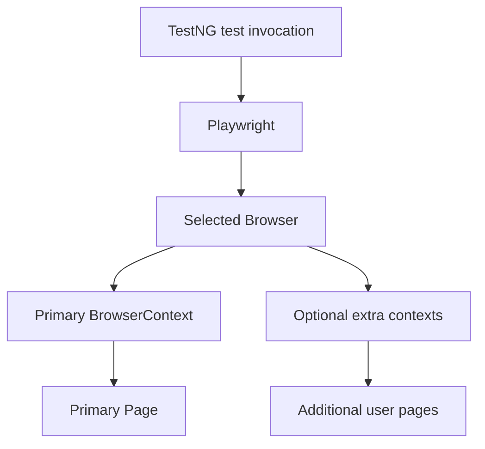

# PlaywrightFactory Documentation

## Production-Grade Playwright Java, Maven, TestNG, and Page Object Model Lifecycle

This document explains the `factory.PlaywrightFactory` and its TestNG integration through `base.BaseTest`.

The implementation is designed for:

- Playwright Java
- Maven
- TestNG
- Page Object Model (POM)
- Local execution from IntelliJ or a terminal
- Jenkins/CI execution
- Sequential or parallel TestNG execution
- Chromium, Firefox, and WebKit
- API and browser-launch debug logging
- One or multiple isolated `BrowserContext` objects in a test

The factory deliberately does **not** introduce a custom `PlaywrightSession` abstraction. Playwright's `BrowserContext` is the browser-session isolation boundary. The factory's responsibility is lifecycle management, configuration, thread confinement, and cleanup.

> **IntelliJ IDEA note:** This is a documentation file, not one Java source file. Complete source-file examples are tagged `java`; explanatory fragments, expressions, and intentionally incomplete examples are tagged `text`. This prevents IntelliJ from treating documentation fragments as compilable Java. To hide those false positives, open `Settings` (`Ctrl+Alt+S`) → `Languages & Frameworks` → `Markdown` and clear **Show problems in code fences**. Keep **Inject languages in code fences** enabled if you still want Java syntax highlighting; clear both options only if you want no code assistance in fenced blocks. See the [JetBrains Markdown documentation](https://www.jetbrains.com/help/idea/markdown.html).

---

## 1. Source files

Place the files under the following packages:

```text
src/test/java
├── base
│   └── BaseTest.java
├── factory
│   └── PlaywrightFactory.java
├── pages
│   └── LoginPage.java
└── tests
    └── LoginTest.java
```

The two framework classes are:

```text
factory.PlaywrightFactory
base.BaseTest
```

`PlaywrightFactory` creates and owns Playwright resources. `BaseTest` connects that lifecycle to TestNG's `@BeforeMethod` and `@AfterMethod` callbacks.

### Java version requirement

This implementation targets **Java 25** and uses stable Java language features—no preview flags are required.

Recommended Maven compiler configuration:

```xml
<properties>
    <maven.compiler.release>25</maven.compiler.release>
    <project.build.sourceEncoding>UTF-8</project.build.sourceEncoding>
</properties>
```

Local execution and Jenkins should both use JDK 25. The `release` value should match the Java version that your project officially supports.

The factory intentionally avoids preview features. A production automation framework should follow the Java release declared by the project rather than requiring preview syntax only for cosmetic reasons.

---

## 2. Core architecture

Every TestNG test invocation receives an independent Playwright object graph:



For two tests running in parallel:

```text
TestNG worker thread 1:
Playwright 1 → Browser 1 → Context 1 → Page 1

TestNG worker thread 2:
Playwright 2 → Browser 2 → Context 2 → Page 2
```

No `Playwright`, `Browser`, `BrowserContext`, or `Page` object is intentionally shared between these test invocations.

This design follows the Playwright Java threading rule: Playwright Java objects are not thread-safe and should be called from the same thread that created the `Playwright` instance.

Official references:

- [Playwright Java multithreading](https://playwright.dev/java/docs/multithreading)
- [Playwright Java test runners](https://playwright.dev/java/docs/test-runners)
- [Playwright browser-context isolation](https://playwright.dev/java/docs/browser-contexts)

---

## 3. Why `ThreadLocal` is used

TestNG can run test methods, classes, instances, or data-provider rows in parallel. A normal static field would allow different worker threads to overwrite or use the same Playwright objects.

Unsafe design:

```text
private static Page page;
```

If two tests run simultaneously, both use the same field. One test can replace or close the page while the other test is still using it.

The factory instead stores a complete `TestState` in:

```text
private static final ThreadLocal<TestState> STATE = new ThreadLocal<>();
```

Each TestNG worker thread sees only the state assigned to that thread.

Important: `ThreadLocal` does not make Playwright objects thread-safe. It prevents accidental sharing by keeping each test invocation's object graph confined to its executing thread.

`STATE.remove()` is always executed during teardown. This is essential because TestNG reuses worker threads. Forgetting to remove a `ThreadLocal` value can retain closed objects and cause memory leaks or state contamination.

---

## 4. Test lifecycle

### Before every test method

`BaseTest` executes:

```text
@BeforeMethod(alwaysRun = true)
public final void setUpPlaywright() {
    PlaywrightFactory.start();
}
```

`start()` performs these operations:

1. Confirms the current thread does not already have active factory state.
2. Reads Maven/JVM system properties.
3. Creates a `Playwright` instance.
4. Selects Chromium, Firefox, or WebKit.
5. Launches the browser.
6. Creates a new isolated `BrowserContext`.
7. Creates the primary `Page`.
8. Stores everything in the current thread's `TestState`.

If startup fails partway through, resources already created are closed before the original exception is rethrown.

### During the test

The test obtains its page through:

```text
page()
```

Page Objects should receive this page through their constructor:

```text
LoginPage loginPage = new LoginPage(page());
```

### After every test method

`BaseTest` executes:

```text
@AfterMethod(alwaysRun = true)
public final void tearDownPlaywright(ITestResult testResult) {
    // Calls PlaywrightFactory.quit()
}
```

`quit()` closes resources in this order:

1. Every tracked `BrowserContext`
2. `Browser`
3. `Playwright`
4. The current thread's `ThreadLocal` value

Context-first cleanup allows Playwright to finish context-level work before the browser process is closed.

If the test and cleanup both fail, the test failure remains the primary TestNG failure. The cleanup failure is attached as a suppressed exception. This prevents a browser-close problem from hiding the actual failed assertion.

---

## 5. Factory API reference

### `start()`

```text
PlaywrightFactory.start();
```

Creates the complete Playwright stack for the current test invocation.

Normally, do not call this directly from a test. `BaseTest` calls it from `@BeforeMethod`.

Calling `start()` twice on the same thread without calling `quit()` throws an `IllegalStateException`. This fail-fast behavior protects the framework from silently replacing live resources.

### `page()`

```text
Page page = PlaywrightFactory.page();
```

Returns the primary page created for the current test.

From a class extending `BaseTest`, use the shorter protected method:

```text
page().navigate("https://example.com");
```

### `context()`

```text
BrowserContext context = PlaywrightFactory.context();
```

Returns the primary context for the current test. This context has isolated cookies, storage, permissions, and login state.

Typical context-level uses include:

```text
context().clearCookies();
context().grantPermissions(java.util.List.of("geolocation"));
```

### `browser()`

```text
Browser browser = PlaywrightFactory.browser();
```

Returns the browser owned by the current test invocation.

Most tests and Page Objects should not need direct browser access. Prefer `page()`, `context()`, or `newContext()`.

### `playwright()`

```text
Playwright playwright = PlaywrightFactory.playwright();
```

Returns the current test's root `Playwright` instance.

This can be useful for advanced APIs, but normal UI Page Objects should depend on `Page`, not on `Playwright`.

### `newContext()`

```text
BrowserContext secondContext = PlaywrightFactory.newContext();
```

Creates another isolated context in the current test's browser. The factory tracks the new context and closes it automatically during `quit()`.

Use this for tests involving multiple independent users.

### `isStarted()`

```text
boolean started = PlaywrightFactory.isStarted();
```

Returns `true` when the current thread has an active `TestState`.

`start()` also uses this method for its fail-fast guard. It is additionally useful in listeners, diagnostics, or defensive framework code.

### `quit()`

```text
PlaywrightFactory.quit();
```

Closes the current test's tracked resources and removes its thread-local state.

The method is safe to call when no state exists; it simply returns. Normally, `BaseTest` calls it automatically.

### Detailed source-code walkthrough

The following walkthrough describes the implementation in `PlaywrightFactory.java` line by line at the design level. The short fragments are explanations, not files to compile. The complete source file remains the source of truth.

#### 1. Imports

The class imports only the Playwright types it owns and the Java collection/concurrency types it needs:

| Import                 | Why it is used                                                           |
|------------------------|--------------------------------------------------------------------------|
| `Browser`              | Represents the launched browser process                                  |
| `BrowserContext`       | Represents an isolated browser session                                   |
| `BrowserType`          | Selects Chromium, Firefox, or WebKit before launch                       |
| `Page`                 | Represents the primary browser tab                                       |
| `Playwright`           | Creates the Playwright driver and exposes browser types                  |
| `ArrayDeque` / `Deque` | Tracks contexts in last-created-first-closed order                       |
| `HashMap` / `Map`      | Copies and passes the driver-process environment                         |
| `Locale`               | Performs deterministic case conversion independent of the machine locale |

No TestNG type is imported into the factory. TestNG calls the factory through `BaseTest`; keeping that dependency direction makes the factory usable from a listener or a small diagnostic program as well.

#### 2. Class declaration and private constructor

`PlaywrightFactory` is `final` because it is a static lifecycle facade, not a base class. Its constructor is private so nobody can create a meaningless factory object. The constructor throws `AssertionError` if reflection or an accidental internal call attempts construction.

The class exposes static methods because the active state is selected by the current TestNG worker thread rather than by a factory instance stored in each Page Object.

#### 3. The `ThreadLocal<TestState>` field

The field is conceptually:

```text
private static final ThreadLocal<TestState> STATE = new ThreadLocal<>();
```

`static` means the class has one registry. `ThreadLocal` means each thread sees a different value in that registry. `TestState` holds the complete object graph for one invocation: `Playwright`, `Browser`, the primary context, the primary page, settings, and every additional context.

This is thread confinement, not thread safety. A `Page` still must not be used by a different thread. `ThreadLocal` only prevents worker 1 from accidentally retrieving worker 2's state.

The value is removed in `quit()` even when cleanup throws. TestNG reuses worker threads, so removal prevents a later test on the same worker from finding closed objects.

#### 4. Property-name constants

The constants such as `BROWSER_PROPERTY`, `DEBUG_PROPERTY`, and `VIEWPORT_WIDTH_PROPERTY` are the single source of truth for command-line names. They prevent spelling differences between parsing, error messages, JavaDoc, and the Maven documentation.

The factory reads Java system properties, not arbitrary environment variables:

```text
System.getProperty("browser", "chromium")
```

Therefore, the same values work from Maven `-D` options, IntelliJ VM options, and Jenkins shell steps. A property is read when `start()` begins, so changing a property after startup does not change an already-created browser.

#### 5. `start()`—the complete startup transaction

`start()` is deliberately written as one startup transaction:

1. It calls `isStarted()` for the current thread.
2. If state already exists, it throws `IllegalStateException` instead of silently replacing live resources.
3. It builds one immutable `Settings` record from the current system properties.
4. It creates `Playwright` with the requested debug environment.
5. It selects and launches one browser engine.
6. It creates the primary isolated `BrowserContext`.
7. It creates the primary `Page` with `context.newPage()`.
8. It stores all resources in a new `TestState`.

The local variables start as `null` because a failure can happen between any two creation steps. The `catch` block passes whichever resources already exist to `closeAfterStartupFailure()`. This gives startup the same all-or-nothing behavior expected from a production fixture: a failed context creation does not leave a browser process behind.

`STATE.set(...)` happens only after the entire primary graph has been created. A partially initialized graph is never published to accessors.

#### 6. Accessor methods

`page()`, `context()`, `browser()`, and `playwright()` all call `requireState()` before returning a resource. This gives a descriptive error when a test calls an accessor before setup or after teardown.

The accessors do not create resources lazily. Lazy creation would make lifecycle ordering less visible and could allow a test to use a page after setup failed. Resource creation belongs to `start()`.

#### 7. `newContext()`—additional isolated users

`newContext()` requires an active state, creates a context in the already-launched browser, and adds it to the state's `Deque`:

```text
BrowserContext context = createContext(state.browser, state.settings);
state.contexts.addFirst(context);
return context;
```

The method does not create another `Playwright` object or another browser process. All contexts in one test share the browser process but have separate cookies, storage, permissions, and login state.

The `Deque` is LIFO: the newest additional context is closed first. The primary context was inserted when `TestState` was constructed, so it remains available until all additional contexts have been attempted during cleanup.

#### 8. `quit()`—deterministic teardown

`quit()` first checks whether the current thread has state. This makes repeated cleanup safe when TestNG invokes cleanup after a startup failure or a defensive caller invokes it twice.

When state exists, the method:

1. Removes and closes every tracked context.
2. Closes the browser after context cleanup has been attempted.
3. Closes the Playwright driver after the browser.
4. Removes the `ThreadLocal` value in a `finally` block.
5. Rethrows the first cleanup failure, if any.

Pages are not closed separately because closing their owning context closes its pages. Closing the context first also lets context-level storage, tracing, downloads, and other work finish before the browser process is closed.

#### 9. `createPlaywright()` and the `DEBUG` environment

Playwright's Java driver is started by `Playwright.create()`. The factory creates a mutable copy of the current process environment:

```text
Map<String, String> environment = new HashMap<>(System.getenv());
environment.put("DEBUG", debugMode.driverValue());
```

The copy matters because `System.getenv()` is not intended to be modified directly. Copying also preserves Jenkins variables such as proxy, certificate, temporary-directory, and locale settings. Only `DEBUG` is deliberately replaced.

The resulting map is passed through `Playwright.CreateOptions.setEnv(...)`. The `DEBUG` value controls Playwright driver logging:

| `DebugMode` | `DEBUG` value       |
|-------------|---------------------|
| `OFF`       | empty string        |
| `API`       | `pw:api`            |
| `BROWSER`   | `pw:browser`        |
| `ALL`       | `pw:api,pw:browser` |

An empty value makes the factory's default run debug-off even if the launching shell previously had a different `DEBUG` variable. This logging is not the Playwright Inspector and does not make a headed browser appear.

#### 10. `launchBrowser()` and browser selection

The `BrowserName` enum is converted to a Playwright `BrowserType` with an exhaustive switch:

```text
BrowserType browserType = switch (settings.browserName()) {
    case CHROMIUM -> playwright.chromium();
    case FIREFOX -> playwright.firefox();
    case WEBKIT -> playwright.webkit();
};
```

The launch options are then applied:

| Option     | Source                       | Meaning                                            |
|------------|------------------------------|----------------------------------------------------|
| `headless` | `settings.headless()`        | Whether a visible browser window is created        |
| `slowMo`   | `settings.slowMoMs()`        | Delay after Playwright operations, in milliseconds |
| `timeout`  | `settings.launchTimeoutMs()` | Maximum browser-launch wait, in milliseconds       |

The factory deliberately supports Playwright's bundled Chromium engine, not a separately installed branded Chrome or Edge channel. Adding channel support would be a separate documented feature.

#### 11. `createContext()` and context options

Every context—primary or additional—uses the same validated context settings:

| Context option  | Source              | Result                                            |
|-----------------|---------------------|---------------------------------------------------|
| Viewport width  | `viewport.width`    | Positive integer width                            |
| Viewport height | `viewport.height`   | Positive integer height                           |
| HTTPS handling  | `ignoreHTTPSErrors` | Certificate validation remains enabled by default |
| Base URL        | `baseUrl`           | Set only when nonblank                            |

The base URL is placed on the context, not on the page. That is why every page created by that context can use relative navigation. A blank base URL leaves Playwright's normal URL rules unchanged.

Additional contexts intentionally reuse these same options. If a test needs a different viewport or base URL, it can create a separate context directly from `browser()` with explicit options, but that context will not be tracked automatically by this factory. The preferred multi-user path is `newContext()` so cleanup remains centralized.

#### 12. `requireState()` and fail-fast access

`requireState()` is the guard used by every accessor and by `newContext()`. When no state exists, it throws an `IllegalStateException` that includes the current thread name and reminds the caller to start the factory from `@BeforeMethod`.

Failing at the accessor boundary is better than returning `null`: the failure points to the lifecycle mistake instead of producing a later, misleading `NullPointerException` in a Page Object.

#### 13. Partial-startup cleanup

`closeAfterStartupFailure()` receives nullable references because startup may fail before all resources exist. It closes only non-null resources, in context → browser → Playwright order.

`closeSafely()` catches a cleanup `RuntimeException` or `Error` and attaches it to the original startup failure with `addSuppressed(...)`. The original startup problem therefore remains the primary exception in TestNG and Jenkins reports.

#### 14. Normal cleanup failure aggregation

`closeResource()` is used by normal `quit()` cleanup. If a close succeeds, it returns the existing failure. If a close fails and there is no previous failure, it records the current failure. If a previous failure already exists, it attaches the current failure as suppressed and continues.

This design attempts every cleanup action instead of stopping at the first broken context. The report contains the first failure plus any later failures, while the browser and driver still receive their close attempts.

`rethrowUnchecked()` handles the accumulated `Throwable` after `ThreadLocal` removal. It rethrows a `RuntimeException` or `Error` unchanged. The checked-exception branch is defensive: the close methods are supplied as `Runnable`, so a checked exception should not normally be possible.

#### 15. `BrowserName` enum

`BrowserName.from(...)` trims whitespace, converts using `Locale.ROOT`, and accepts exactly `chromium`, `firefox`, and `webkit`. It throws a descriptive `IllegalArgumentException` for values such as `chrome`, `edge`, or a misspelling.

Explicit parsing is preferable here to `Enum.valueOf(...)` because the external command-line vocabulary is lowercase and should not expose enum naming details in the error message.

#### 16. `DebugMode` enum

`DebugMode.from(...)` also trims, lowercases with `Locale.ROOT`, and removes ordinary spaces. It accepts these user-facing forms:

| Input examples                                                    | Result    |
|-------------------------------------------------------------------|-----------|
| empty, `off`, `false`, `none`                                     | `OFF`     |
| `api`, `pw:api`                                                   | `API`     |
| `browser`, `pw:browser`, `pw:browser*`                            | `BROWSER` |
| `all`, `true`, `api,browser`, `browser,api`                       | `ALL`     |
| `pw:api,pw:browser`, reversed order, or forms using `pw:browser*` | `ALL`     |

The enum stores the exact driver value separately from the accepted aliases. This lets the command-line parser be friendly while keeping the environment passed to Playwright predictable.

#### 17. Immutable `Settings` record

`Settings` is a private record containing the resolved configuration for one test invocation. A record is appropriate because configuration is read once, then should not mutate while the browser is running.

The record also gives clear accessor names such as `settings.browserName()` and `settings.headless()`. It avoids a mutable configuration object whose values could change halfway through setup.

`Settings.fromSystemProperties()` applies defaults and validation exactly once per `start()` call. A second test invocation reads the current properties again, so separate Maven processes or separately configured JVMs can run different settings predictably.

#### 18. `TestState` resource ownership

`TestState` is private because application tests should not manipulate its internals. It owns:

```text
Playwright playwright
Browser browser
BrowserContext primaryContext
Page page
Settings settings
Deque<BrowserContext> contexts
```

The constructor adds the primary context to the deque immediately. Every later context returned by `newContext()` is added to the same deque. Consequently, `quit()` has one authoritative list and cannot accidentally forget a context created through the factory API.

#### 19. Validation helpers

The validation helpers intentionally separate syntax parsing from policy validation:

| Helper                  |           Accepted default | Rule                                          |
|-------------------------|---------------------------:|-----------------------------------------------|
| `readBoolean`           |          property-specific | only `true` or `false`, case-insensitive      |
| `readPositiveInt`       |          property-specific | integer greater than zero                     |
| `readNonNegativeDouble` |           `0` for `slowMo` | finite number greater than or equal to zero   |
| `readPositiveDouble`    | `30000` for launch timeout | finite number greater than zero               |
| `readFiniteDouble`      |          property-specific | rejects malformed, `NaN`, and infinite values |

Blank or missing properties use their defaults. Nonblank invalid values fail before any browser is launched. This is important in Jenkins: a typo in a parameter should fail the build clearly instead of silently running with Chromium defaults.

The two policy helpers have a targeted `@SuppressWarnings("SameParameterValue")` annotation. IntelliJ notices that their private call sites use fixed property/default pairs, but that is intentional: the helpers still read the property name at runtime through `readFiniteDouble(...)` and retain the shared validation logic. The annotation suppresses only that IDE inspection; it does not disable validation or affect the compiled behavior.

#### 20. Why the factory has no login/session wrapper

Playwright itself manages browser resources, and `BrowserContext` supplies isolated browser-session state. This factory adds only test-framework ownership and cleanup. Login workflows, storage-state files, roles such as administrator/customer, and application session rules belong in fixtures or Page Objects.

A custom `PlaywrightSession` class is therefore optional project vocabulary, not a Playwright requirement. Adding one is justified only when it provides application-specific value such as a named role, login helper, or storage-state policy.

#### 21. End-to-end call graph

The normal call path is:

```text
TestNG @BeforeMethod
    → BaseTest.setUpPlaywright()
        → PlaywrightFactory.start()
            → Settings.fromSystemProperties()
            → createPlaywright()
            → launchBrowser()
            → createContext()
            → context.newPage()
            → STATE.set(TestState)

Test method
    → BaseTest.page() or PlaywrightFactory.page()
        → requireState()
            → current thread's Page

TestNG @AfterMethod
    → BaseTest.tearDownPlaywright()
        → PlaywrightFactory.quit()
            → close contexts
            → close browser
            → close Playwright
            → STATE.remove()
```

This call graph explains the framework boundary: tests use resources, the factory owns resources, and TestNG/BaseTest decides when ownership begins and ends.

---

## 6. Runtime properties

The factory reads Java system properties supplied with Maven's `-D` syntax.

| Property                | Allowed value                                 |    Default | Purpose                                        |
|-------------------------|-----------------------------------------------|-----------:|------------------------------------------------|
| `browser`               | `chromium`, `firefox`, `webkit`               | `chromium` | Selects the browser engine                     |
| `playwright.debug`      | `off`, `api`, `browser`, `all`, `api,browser` |      `off` | Controls Playwright debug logs                 |
| `headless`              | `true`, `false`                               |     `true` | Controls whether the browser UI is visible     |
| `slowMo`                | Zero or positive milliseconds                 |        `0` | Slows Playwright operations for observation    |
| `browser.launchTimeout` | Positive milliseconds                         |    `30000` | Browser-launch timeout                         |
| `baseUrl`               | URL string                                    |      Empty | Base URL used by relative navigation           |
| `viewport.width`        | Positive integer                              |     `1920` | Browser viewport width                         |
| `viewport.height`       | Positive integer                              |     `1080` | Browser viewport height                        |
| `ignoreHTTPSErrors`     | `true`, `false`                               |    `false` | Allows invalid HTTPS certificates when enabled |

Property values are validated. An unsupported browser, invalid Boolean, negative `slowMo`, or nonnumeric timeout fails immediately with a descriptive `IllegalArgumentException`.

Browser-name validation uses an explicit modern switch expression:

```text
return switch (normalized) {
    case "chromium" -> CHROMIUM;
    case "firefox" -> FIREFOX;
    case "webkit" -> WEBKIT;
    default -> throw new IllegalArgumentException(
            "Unsupported browser: " + value
    );
};
```

This avoids using `Enum.valueOf()` exceptions as normal validation flow and makes every accepted command-line value visible in one place.

### Default execution

```bash
mvn clean test
```

Effective configuration:

```text
browser=chromium
playwright.debug=off
headless=true
slowMo=0
browser.launchTimeout=30000
viewport=1920x1080
ignoreHTTPSErrors=false
```

### Run headed locally

```bash
mvn clean test -Dheadless=false
```

### Run Firefox

```bash
mvn clean test -Dbrowser=firefox
```

### Run WebKit

```bash
mvn clean test -Dbrowser=webkit
```

### Run headed with slow motion

```bash
mvn clean test -Dheadless=false -DslowMo=500
```

### Use a base URL

```bash
mvn clean test -DbaseUrl=https://test.example.com
```

The test can then navigate with a relative URL:

```text
page().navigate("/login");
```

### Custom viewport

```bash
mvn clean test \
  -Dviewport.width=1440 \
  -Dviewport.height=900
```

On Windows PowerShell, the same command can be written on one line:

```powershell
mvn clean test -Dviewport.width=1440 -Dviewport.height=900
```

### Ignore HTTPS certificate errors

```bash
mvn clean test -DignoreHTTPSErrors=true
```

Use this only when a controlled nonproduction environment has a self-signed or otherwise invalid certificate. Do not use it as the normal production default.

---

## 7. Debug logging

The factory converts `playwright.debug` into the `DEBUG` environment variable supplied to the Playwright driver process.

| Maven property                   | Driver `DEBUG` value | Main use                                           |
|----------------------------------|----------------------|----------------------------------------------------|
| `-Dplaywright.debug=off`         | Empty                | Normal execution without verbose logs              |
| `-Dplaywright.debug=api`         | `pw:api`             | Playwright API calls, locators, actions, and waits |
| `-Dplaywright.debug=browser`     | `pw:browser`         | Browser launch and browser-process diagnostics     |
| `-Dplaywright.debug=all`         | `pw:api,pw:browser`  | API and browser diagnostics together               |
| `-Dplaywright.debug=api,browser` | `pw:api,pw:browser`  | Same combined mode using an explicit list          |

Aliases accepted by the parser include `pw:api`, `pw:browser`, and the supported combined forms.

### API debugging

```bash
mvn clean test -Dplaywright.debug=api
```

Use it when investigating:

- Locator resolution
- Auto-waiting
- Click or fill behavior
- Navigation timing
- Actionability failures

### Browser debugging

```bash
mvn clean test -Dplaywright.debug=browser
```

Use it when investigating:

- Browser executable problems
- Missing browser binaries
- Browser-launch failures
- CI/container launch behavior
- Browser process exits

### Combined debugging

Either command is valid:

```bash
mvn clean test -Dplaywright.debug=all
```

```bash
mvn clean test -Dplaywright.debug=api,browser
```

Combined debugging is verbose. It is useful for a focused failed test but should not normally be enabled for an entire large Jenkins regression suite.

### Complete local troubleshooting command

```bash
mvn clean test \
  -Dbrowser=chromium \
  -Dheadless=false \
  -DslowMo=300 \
  -Dplaywright.debug=all
```

Debug logs can contain application URLs, request information, locator text, and other test details. Review your organization's logging policy before retaining verbose CI logs.

---

## 8. TestNG integration

Every UI test should extend `BaseTest`:

```java
package tests;

import base.BaseTest;
import org.testng.annotations.Test;

import static com.microsoft.playwright.assertions.PlaywrightAssertions.assertThat;

public final class HomePageTest extends BaseTest {

    @Test
    public void shouldDisplayHomePageTitle() {
        page().navigate("https://playwright.dev");
        assertThat(page()).hasTitle(java.util.regex.Pattern.compile("Playwright"));
    }
}
```

Do not call `PlaywrightFactory.start()` or `quit()` inside each test method. `BaseTest` already owns that lifecycle.

The lifecycle methods are `final` so subclasses cannot accidentally override them and skip required initialization or cleanup.

If a subclass needs its own setup, add another TestNG configuration method:

```text
@BeforeMethod
public void prepareApplicationState() {
    page().navigate("/login");
}
```

TestNG runs inherited configuration methods before subclass configuration methods. Avoid calling `super.setUpPlaywright()` manually because TestNG invokes it automatically.

---

## 9. Page Object Model integration

A Page Object should receive `Page` through constructor injection.

```java
package pages;

import com.microsoft.playwright.Page;

public final class LoginPage {

    private final Page page;

    public LoginPage(Page page) {
        this.page = page;
    }

    public LoginPage open() {
        page.navigate("/login");
        return this;
    }

    public LoginPage enterUsername(String username) {
        page.getByLabel("Username").fill(username);
        return this;
    }

    public LoginPage enterPassword(String password) {
        page.getByLabel("Password").fill(password);
        return this;
    }

    public void submit() {
        page.getByRole(
                com.microsoft.playwright.options.AriaRole.BUTTON,
                new Page.GetByRoleOptions().setName("Sign in").setExact(true)
        ).click();
    }
}
```

Test example:

```java
package tests;

import base.BaseTest;
import org.testng.annotations.Test;
import pages.LoginPage;

public final class LoginTest extends BaseTest {

    @Test
    public void validUserCanLogin() {
        LoginPage loginPage = new LoginPage(page());

        loginPage
                .open()
                .enterUsername("test-user")
                .enterPassword("test-password")
                .submit();
    }
}
```

Recommended dependency direction:

```text
Test → Page Object → Playwright Page
Test → BaseTest → PlaywrightFactory
```

Avoid calling `PlaywrightFactory.page()` directly inside every Page Object. Passing `Page` through the constructor makes the Page Object easier to test, reuse, and understand. It also allows the same Page Object class to work with pages belonging to different contexts.

---

## 10. Multiple users and multiple contexts

A `BrowserContext` is an isolated, incognito-like browser session. Two contexts do not share cookies, local storage, session storage, or login state.

Example: administrator and customer in the same test.

```text
@Test
public void adminCanSeeCustomerOrder() {
    // The primary context/page represents the customer.
    Page customerPage = page();
    customerPage.navigate("/customer/login");

    // A second isolated context represents the administrator.
    BrowserContext adminContext = newContext();
    Page adminPage = adminContext.newPage();
    adminPage.navigate("/admin/login");

    LoginPage customerLogin = new LoginPage(customerPage);
    LoginPage adminLogin = new LoginPage(adminPage);

    // Continue the two-user workflow on the same TestNG worker thread.
}
```

The extra context is registered inside the factory:

```text
state.contexts.addFirst(context);
```

Therefore `quit()` closes both the primary and additional contexts.

Important rules:

- Multiple contexts are supported.
- Each context represents a separate browser session.
- Additional contexts use the same runtime base URL, viewport, and HTTPS settings.
- All contexts and pages belonging to one factory state must remain on the same Playwright-owning thread.
- Do not start Java threads inside the test and pass Playwright objects to them.

---

## 11. Parallel TestNG execution

### Parallel methods

Example `testng.xml`:

```xml
<?xml version="1.0" encoding="UTF-8"?>
<!DOCTYPE suite SYSTEM "https://testng.org/testng-1.0.dtd">
<suite name="UI Regression" parallel="methods" thread-count="4">
    <test name="UI Tests">
        <packages>
            <package name="tests"/>
        </packages>
    </test>
</suite>
```

Each method invocation runs `@BeforeMethod`, receives its own Playwright stack, and runs `@AfterMethod` on completion.

### Parallel classes

```xml
<?xml version="1.0" encoding="UTF-8"?>
<!DOCTYPE suite SYSTEM "https://testng.org/testng-1.0.dtd">
<suite name="UI Regression" parallel="classes" thread-count="4">
    <test name="UI Tests">
        <packages>
            <package name="tests"/>
        </packages>
    </test>
</suite>
```

The same factory remains safe because resource creation occurs per test method rather than through shared static browser fields.

### Parallel DataProvider

```text
@DataProvider(name = "users", parallel = true)
public Object[][] users() {
    return new Object[][] {
            {"user1", "password1"},
            {"user2", "password2"},
            {"user3", "password3"}
    };
}

@Test(dataProvider = "users")
public void userCanLogin(String username, String password) {
    new LoginPage(page())
            .open()
            .enterUsername(username)
            .enterPassword(password)
            .submit();
}
```

Each DataProvider invocation receives an independent factory lifecycle.

### Parallelism tradeoff

This factory launches one browser per test invocation. That provides simple, predictable thread isolation across TestNG modes, but browser startup is more expensive than reusing a browser.

Do not optimize by creating one static browser and calling `browser.newContext()` from multiple threads. Contexts isolate browser state, but a shared Playwright Java `Browser` is still not thread-safe.

If future performance measurements justify optimization, use a carefully managed Playwright-and-Browser pair per TestNG worker thread, with creation, use, and cleanup occurring on the same thread. That is a separate lifecycle design and should not be mixed casually with this per-invocation factory.

---

## 12. Maven Surefire integration

The factory does not require Maven profiles. Maven system properties are available through `System.getProperty(...)` automatically.

Example Surefire configuration:

```xml
<build>
    <plugins>
        <plugin>
            <groupId>org.apache.maven.plugins</groupId>
            <artifactId>maven-surefire-plugin</artifactId>
            <version>${maven.surefire.version}</version>
            <configuration>
                <suiteXmlFiles>
                    <suiteXmlFile>testng.xml</suiteXmlFile>
                </suiteXmlFiles>
            </configuration>
        </plugin>
    </plugins>
</build>
```

Keep the Surefire version in the POM's properties section so the project pins a known version:

```xml
<properties>
    <maven.surefire.version>YOUR_APPROVED_VERSION</maven.surefire.version>
</properties>
```

Do not put environment-specific browser values permanently inside the factory source. Supply them at runtime:

```bash
mvn clean test \
  -Dbrowser=firefox \
  -Dheadless=true \
  -DbaseUrl=https://qa.example.com
```

System properties can also be defined by a Maven profile when your organization already uses profiles, but command-line `-D` values are the simplest override mechanism for local and Jenkins execution.

---

## 13. Installing browser binaries

The Playwright Java dependency and Playwright browser binaries are separate requirements.

After adding or updating the Playwright dependency, install the supported browsers using the Playwright CLI configured in your project. A common Maven command is:

```bash
mvn exec:java \
  -Dexec.mainClass=com.microsoft.playwright.CLI \
  -Dexec.args="install"
```

For Linux CI agents that need operating-system dependencies, use the installation approach recommended for your agent image. Browser versions must match the Playwright Java version used by the project.

Official reference: [Playwright Java browsers](https://playwright.dev/java/docs/browsers)

---

## 14. Jenkins usage

### Declarative Pipeline example

```groovy
pipeline {
    agent any

    parameters {
        choice(
            name: 'BROWSER',
            choices: ['chromium', 'firefox', 'webkit'],
            description: 'Playwright browser engine'
        )
        choice(
            name: 'DEBUG_MODE',
            choices: ['off', 'api', 'browser', 'all'],
            description: 'Playwright debug logging'
        )
        booleanParam(
            name: 'HEADLESS',
            defaultValue: true,
            description: 'Run without a visible browser window'
        )
        string(
            name: 'BASE_URL',
            defaultValue: 'https://qa.example.com',
            description: 'Application base URL'
        )
    }

    stages {
        stage('Test') {
            steps {
                sh '''
                    mvn clean test \
                      -Dbrowser="$BROWSER" \
                      -Dplaywright.debug="$DEBUG_MODE" \
                      -Dheadless="$HEADLESS" \
                      -DbaseUrl="$BASE_URL"
                '''
            }
        }
    }

    post {
        always {
            junit allowEmptyResults: true,
                  testResults: 'target/surefire-reports/*.xml'
            archiveArtifacts allowEmptyArchive: true,
                             artifacts: 'target/**'
        }
    }
}
```

The factory copies the current process environment before adding its `DEBUG` value. This preserves environment variables available to the Jenkins Java process, including relevant proxy, certificate, and temporary-directory configuration.

Recommended CI defaults:

```text
BROWSER=chromium
DEBUG_MODE=off
HEADLESS=true
```

Turn on verbose debug logging only for targeted troubleshooting.

### Cross-browser Jenkins stages

For a cross-browser pipeline, run separate Maven processes or stages:

```groovy
stage('Chromium') {
    steps {
        sh 'mvn test -Dbrowser=chromium -Dheadless=true'
    }
}

stage('Firefox') {
    steps {
        sh 'mvn test -Dbrowser=firefox -Dheadless=true'
    }
}

stage('WebKit') {
    steps {
        sh 'mvn test -Dbrowser=webkit -Dheadless=true'
    }
}
```

Separate Maven processes avoid trying to change the global `browser` system property while tests are already running inside the same JVM.

---

## 15. IntelliJ execution

When running from the green TestNG icon, add factory properties as **VM options**, not as program arguments.

Example VM options:

```text
-Dbrowser=chromium
-Dheadless=false
-DslowMo=250
-Dplaywright.debug=api
-DbaseUrl=https://qa.example.com
```

If you run without VM options, the factory intentionally uses its defaults:

```text
Chromium + headless + no debug logging
```

Therefore, not seeing a browser window during a default IntelliJ run is expected. Use:

```text
-Dheadless=false
```

when you want to watch the browser.

---

## 16. Configuration validation

The factory validates all runtime input before continuing.

Examples of invalid commands:

```bash
mvn test -Dbrowser=chrome
mvn test -Dheadless=yes
mvn test -DslowMo=-100
mvn test -Dbrowser.launchTimeout=abc
mvn test -Dviewport.width=0
mvn test -Dplaywright.debug=network
```

Why `chrome` is rejected:

```text
chromium = Playwright's bundled Chromium browser engine
chrome   = a branded channel, which this factory does not currently configure
```

Allowed browser values are exactly:

```text
chromium
firefox
webkit
```

Failing fast is preferable to silently falling back to Chromium after the caller makes a spelling mistake. A silent fallback could make a Jenkins job report that Firefox passed even though Chromium actually ran.

---

## 17. Failure and cleanup behavior

### Failure during startup

Possible sequence:

```text
Playwright created
Browser launched
Context creation fails
```

The startup error handler attempts to close the browser and Playwright before rethrowing the original failure. Cleanup exceptions are attached to the startup failure as suppressed exceptions.

### Failure during the test

If an assertion fails, `@AfterMethod(alwaysRun = true)` still calls `quit()`.

### Failure during cleanup

The factory attempts all remaining cleanup actions even if one context fails to close. It keeps the first cleanup failure and attaches later cleanup failures as suppressed exceptions.

### Test failure plus cleanup failure

`BaseTest` preserves the real test failure as the primary result:

```text
Primary exception: assertion/test failure
Suppressed exception: cleanup failure
```

This makes Jenkins and TestNG reports point to the actual application or assertion problem.

---

## 18. Responsibilities and boundaries

### The factory is responsible for

- Reading and validating runtime properties
- Creating Playwright on the test's worker thread
- Selecting the browser engine
- Launching the browser
- Creating the primary context and page
- Creating and tracking additional contexts
- Keeping test resources thread-confined
- Closing resources after the test
- Cleaning up partial startup failures

### The factory is not responsible for

- Application login workflows
- Storing usernames or passwords
- Page locators
- Test assertions
- Page Object business methods
- Test data management
- TestNG suite grouping
- Reporting-library configuration
- Retry decisions
- Automatically sharing authenticated state

Authentication setup belongs in a fixture, helper, or application-specific layer. Page behavior belongs in Page Objects. Assertions belong in tests or assertion-focused components.

---

## 19. Common mistakes to avoid

### Do not create a static shared page

```text
private static Page page;
```

This breaks parallel isolation.

### Do not share one static browser across parallel methods

```text
private static Browser browser;
```

Creating separate contexts does not make a shared Java `Browser` safe for concurrent thread access.

### Do not create Playwright inside a Page Object

```text
public LoginPage() {
    Playwright playwright = Playwright.create();
}
```

Page Objects should use the `Page` supplied by the test lifecycle.

### Do not close the factory page inside a Page Object

```text
page.close();
```

The framework owns resource cleanup. A Page Object should not unexpectedly terminate resources owned by the test.

### Do not call `start()` twice

`BaseTest` already starts the factory. Calling it again produces an intentional error.

### Do not forget to extend `BaseTest`

Without `BaseTest`, calling `page()` before `start()` produces:

```text
Playwright is not initialized for thread ...
```

### Do not pass Playwright objects to another Java thread

This includes `Page`, `BrowserContext`, and `Browser`. Keep the entire test flow on its TestNG worker thread.

### Do not use `Thread.sleep()` as a Playwright wait

Prefer Playwright locators, assertions, and `waitFor...` APIs. Playwright's auto-waiting is designed to wait for actionability conditions.

---

## 20. Troubleshooting guide

### Browser window does not appear

Cause:

```text
headless defaults to true
```

Solution:

```bash
mvn test -Dheadless=false
```

### Unsupported browser error

Use one of:

```text
-Dbrowser=chromium
-Dbrowser=firefox
-Dbrowser=webkit
```

### Browser executable is missing

Install the Playwright browsers matching the dependency version:

```bash
mvn exec:java \
  -Dexec.mainClass=com.microsoft.playwright.CLI \
  -Dexec.args="install"
```

### Browser fails only in Jenkins

Start with browser diagnostics:

```bash
mvn test -Dplaywright.debug=browser -Dheadless=true
```

Check:

- Browser binaries installed on the agent
- Required Linux libraries
- Workspace permissions
- Proxy and certificate settings
- Available memory and shared memory
- Playwright/browser version compatibility

Official reference: [Playwright Java CI documentation](https://playwright.dev/java/docs/ci)

### Locator or click failure

Run a focused test with:

```bash
mvn test \
  -Dtest=LoginTest \
  -Dplaywright.debug=api \
  -Dheadless=false \
  -DslowMo=250
```

### `Playwright is already initialized`

The current thread called `start()` twice without a matching `quit()`.

Check for:

- A test manually calling `start()` while extending `BaseTest`
- Duplicate setup hooks
- A listener and `BaseTest` both controlling the same lifecycle

Use only one lifecycle owner.

### `Playwright is not initialized`

The code called a factory accessor before `start()` or after `quit()`.

Check that:

- The test extends `BaseTest`
- The method is executing as a TestNG test
- A helper is not running before `@BeforeMethod`
- Application teardown code is not trying to use `page()` after factory cleanup

### Parallel tests affect each other's login

With this factory, each invocation has its own browser and context. If interference remains, investigate shared external application data rather than browser cookies—for example, tests modifying the same database record or using the same account concurrently.

---

## 21. Recommended usage checklist

Before committing a new UI test:

- [ ] Test class extends `BaseTest`
- [ ] Page Objects receive `Page` through their constructors
- [ ] No static `Page`, `BrowserContext`, `Browser`, or `Playwright` fields exist
- [ ] Test does not manually call `start()` or `quit()`
- [ ] Additional users use `newContext()`
- [ ] Playwright objects remain on the owning TestNG thread
- [ ] Browser selection comes from `-Dbrowser`
- [ ] CI defaults to `-Dheadless=true`
- [ ] Debug logging is normally off
- [ ] Secrets are not hardcoded in tests, commands, or Jenkinsfiles
- [ ] Browser binaries match the project's Playwright version
- [ ] Parallel tests use independent application test data where required

---

## 22. Frequently asked questions

### Is `BrowserContext` equivalent to incognito mode?

It is incognito-like isolation. Each context has separate cookies and browser storage. Playwright contexts are lightweight and designed for test isolation.

### Does `BrowserContext` make parallel Java code thread-safe?

No. It isolates browser state. It does not change the Playwright Java threading rules.

### Is `PlaywrightSession.java` required?

No. It would only be a project wrapper. This framework uses `BrowserContext` for browser-session isolation and `TestState` internally for resource ownership.

### Why does each test launch a browser?

It provides the clearest and safest behavior across TestNG parallel methods, classes, DataProviders, local execution, and Jenkins. The tradeoff is additional startup time.

### Can one test create more than one context?

Yes. Use `newContext()`. Every returned context is tracked and closed automatically.

### Can one context contain multiple pages?

Yes:

```text
Page firstPage = context().newPage();
Page secondPage = context().newPage();
```

Those pages share the same context session. To represent a different logged-in user, create another context instead.

### Can I run different browsers in the same Maven JVM simultaneously?

The current factory reads the global `browser` system property. For predictable cross-browser execution, run separate Maven processes or Jenkins stages for Chromium, Firefox, and WebKit.

### Can the default browser be changed?

Yes, but keeping Chromium as the default is conventional. Change the default only in this line if the whole project intentionally adopts another default:

```text
System.getProperty(BROWSER_PROPERTY, "chromium")
```

### Why is `ignoreHTTPSErrors` false by default?

Certificate problems should normally remain visible. Enable it explicitly only for a controlled environment that requires it.

### Does `pw:api` open Playwright Inspector?

No. `pw:api` produces API debug logs. Playwright Inspector is a separate debugging feature controlled through Playwright's inspector/debug configuration.

---

## 23. Java 25 implementation choices

The class uses modern Java features where they improve safety or clarity.

### Exhaustive enum switch expression

```text
BrowserType browserType = switch (settings.browserName()) {
    case CHROMIUM -> playwright.chromium();
    case FIREFOX -> playwright.firefox();
    case WEBKIT -> playwright.webkit();
};
```

There is intentionally no `default` branch. All `BrowserName` enum constants are covered. If another enum constant is added later, the compiler forces the browser-selection logic to be reviewed.

### String switch expressions for configuration parsing

`BrowserName.from()`, `DebugMode.from()`, and Boolean-property validation use arrow-style switch expressions. These avoid fall-through and eliminate unnecessary `break` statements.

### Record for immutable settings

```text
private record Settings(
        BrowserName browserName,
        DebugMode debugMode,
        boolean headless,
        double slowMoMs,
        double launchTimeoutMs,
        String baseUrl,
        int viewportWidth,
        int viewportHeight,
        boolean ignoreHTTPSErrors) {
}
```

`Settings` is an immutable configuration carrier, so a record is more appropriate than a mutable JavaBean. Factory code consistently uses the generated accessors, such as:

```text
settings.browserName()
settings.headless()
settings.baseUrl()
```

### Pattern matching for switch

Cleanup failure propagation uses the stable pattern-matching `switch` available in Java 21 and Java 25:

```text
switch (failure) {
    case null -> {
        // No cleanup failure.
    }
    case RuntimeException runtimeException -> throw runtimeException;
    case Error error -> throw error;
    default -> throw new IllegalStateException(
            "Unexpected checked exception during Playwright cleanup",
            failure
    );
}
```

The `default` branch documents and enforces the invariant that resource-closing operations should not produce a checked exception through `Runnable`.

### Other appropriate language features

The implementation also uses:

- Multi-catch for identical `RuntimeException` and `Error` handling
- Method references such as `context::close`
- The diamond operator for generic construction
- `final` classes and fields where mutation or inheritance is not intended
- A private constructor for the static utility class

It deliberately does not add `var`, virtual threads, sealed types, streams, or asynchronous APIs where they would make the synchronous Playwright lifecycle harder to understand. Newer syntax is valuable only when it improves correctness, maintainability, or compile-time checking.

Official Java language references:

- [Java switch expressions—JEP 361](https://openjdk.org/jeps/361)
- [Java records—JEP 395](https://openjdk.org/jeps/395)
- [Pattern matching for switch—JEP 441](https://openjdk.org/jeps/441)
- [Java SE 25 language changes by release](https://docs.oracle.com/en/java/javase/25/language/java-language-changes-release.html)

---

## 24. Design summary

The factory uses this ownership model:

```text
TestNG invocation owns:
    one Playwright
    one Browser
    one primary BrowserContext
    one primary Page
    zero or more additional BrowserContexts
```

The most important rules are:

1. One test invocation owns its Playwright resources.
2. Playwright objects stay on the thread that created them.
3. Every test receives fresh browser-session state.
4. Additional users receive additional contexts.
5. `BaseTest` controls setup and cleanup.
6. Page Objects receive `Page` through constructor injection.
7. Runtime behavior comes from validated Maven `-D` properties.
8. Default execution is Chromium, headless, and debug-off.
9. Cleanup never intentionally hides the original test failure.
10. No custom `PlaywrightSession` class is required.
11. Source code targets stable Java 25 language features without preview options.

This creates a clear separation between framework lifecycle, browser-session isolation, Page Objects, and test logic while remaining practical for local development and Jenkins execution.
